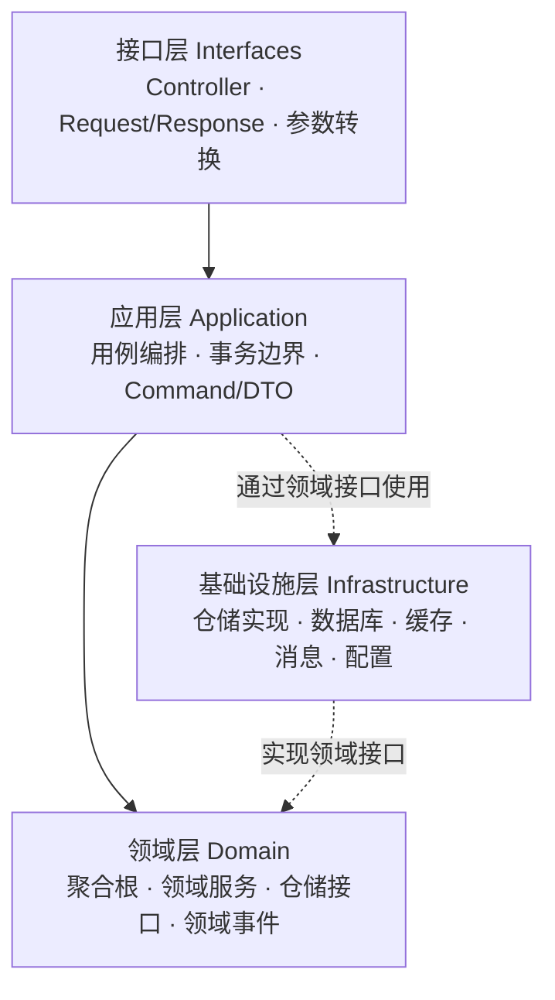
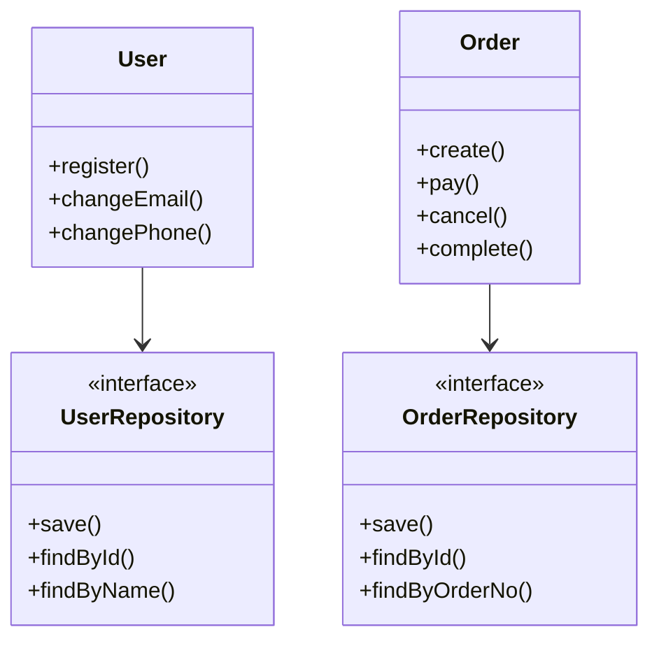
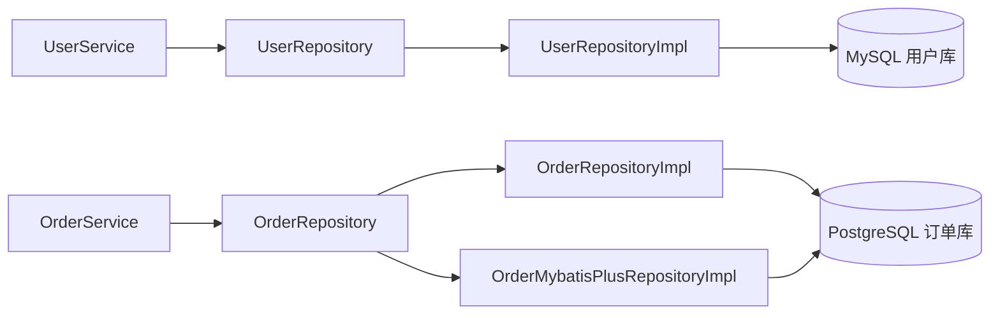
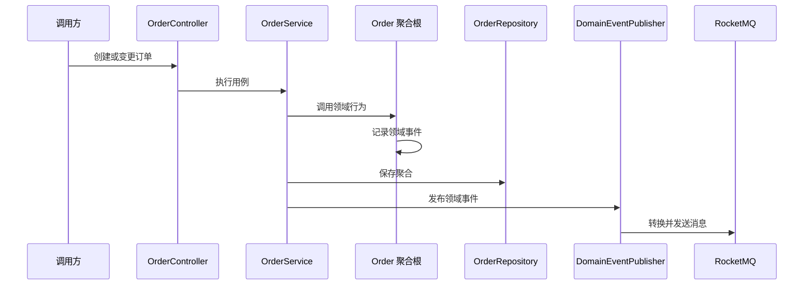

# Spring Boot 4.1 + JDK 25 DDD 工程脚手架

一个基于 Spring Boot 4.1、JDK 25 和领域驱动设计（DDD）的 Java 工程脚手架。项目采用清晰的四层架构，内置多数据源、Redis 缓存、RocketMQ 领域事件、API 签名、统一响应、全局异常处理、定时任务和邮件通知等常用能力。

本文档由原有的项目说明、Spring Boot 4.1 指南、DDD 脚手架教程合并而成，仅保留中文版本，并以当前代码和配置为准。

## 目录

- [核心特性](#核心特性)
- [技术栈](#技术栈)
- [DDD 架构](#ddd-架构)
- [项目结构](#项目结构)
- [快速开始](#快速开始)
- [配置说明](#配置说明)
- [API 接口](#api-接口)
- [新功能开发指南](#新功能开发指南)
- [RocketMQ 事件驱动](#rocketmq-事件驱动)
- [Agent 编程指南](#agent-编程指南)
- [开发规范与最佳实践](#开发规范与最佳实践)
- [常见问题](#常见问题)
- [扩展文档](#扩展文档)

## 核心特性

- 严格的 DDD 四层架构：接口层、应用层、领域层、基础设施层职责分离
- MySQL 与 PostgreSQL 双数据源，分别管理用户和订单数据
- JDBC、Spring Data JDBC 与 MyBatis-Plus 多种数据访问方式
- Redis 缓存与缓存穿透处理示例
- RocketMQ 领域事件发布及优雅降级
- 基于 SHA-256 的 API 签名验证
- Jakarta Validation 参数校验
- 统一 API 响应与全局异常处理
- 定时任务、邮件通知、健康检查和依赖状态监控
- 分页、排序及领域分页模型转换
- 面向 Agent 编程的目录约束和提示词模板

## 技术栈

| 分类 | 技术 | 版本或说明 |
|---|---|---|
| 运行环境 | JDK | 25 |
| 应用框架 | Spring Boot | 4.1.0 |
| Web | Spring MVC | Spring Boot 管理版本 |
| 数据访问 | Spring JDBC / Spring Data JDBC | Spring Boot 管理版本 |
| 数据访问 | MyBatis-Plus | 3.5.16 |
| 用户数据库 | MySQL | 8.0+ |
| 订单数据库 | PostgreSQL | 14+ |
| 测试数据库 | H2 | 测试依赖 |
| 缓存 | Redis | 6.0+ |
| 消息队列 | RocketMQ | Starter 2.3.4 |
| 参数校验 | Jakarta Validation | Spring Boot 管理版本 |
| 邮件 | Spring Mail | Spring Boot 管理版本 |
| 构建工具 | Maven Wrapper | Maven 3.9.12 |
| 辅助工具 | Lombok、Commons Codec、Commons Lang3 | Maven 管理 |

> 请优先使用项目自带的 `./mvnw`，避免本机 Maven 版本差异。

## DDD 架构

### 四层架构



| 层级 | 主要职责 | 约束 |
|---|---|---|
| 接口层 | 接收 HTTP 请求、参数校验、请求与命令转换、统一响应 | 不编写业务规则 |
| 应用层 | 编排领域对象、控制事务、转换 DTO、发布领域事件 | 保持轻量，不承载核心业务规则 |
| 领域层 | 聚合根、实体、值对象、领域服务、仓储接口、领域事件 | 尽量保持纯净，不依赖具体基础设施 |
| 基础设施层 | 数据库访问、仓储实现、缓存、消息、邮件、配置和中间件 | 实现领域层定义的接口 |

### 依赖方向

```text
interfaces -> application -> domain <- infrastructure
```

领域层位于核心位置。仓储接口定义在领域层，具体实现放在基础设施层；应用层只负责用例编排，接口层只负责协议适配。

### 主要领域模型



### 多数据源架构



两个数据源分别配置连接池和事务管理器：

- `userDataSource` / `userTransactionManager`：MySQL 用户库
- `orderDataSource` / `orderTransactionManager`：PostgreSQL 订单库
- `order.repository.implementation`：选择订单仓储的 `jdbc` 或 `mybatis-plus` 实现

跨数据源操作不使用本地事务强行绑定，通过应用服务编排和领域事件实现最终一致性。

## 项目结构

```text
springboot4ddd/
├── pom.xml
├── mvnw
├── README.md
├── docs/
│   ├── API_TEST_CASES.md
│   ├── DATABASE.md
│   ├── IMPLEMENTATION_SUMMARY.md
│   ├── REDIS_CACHE_GUIDE.md
│   ├── REPOSITORY_IMPLEMENTATION_GUIDE.md
│   ├── SCHEDULED_TASKS_AND_EMAIL.md
│   ├── SIGN_GUIDE.md
│   └── TUTORIAL.md
├── src/main/java/com/hanserwei/springboot4ddd/
│   ├── Application.java
│   ├── domain/
│   │   ├── client/               # 领域定义的外部能力接口
│   │   ├── event/                # 领域事件与发布接口
│   │   ├── exception/            # 领域异常
│   │   ├── model/                # 聚合根、实体和值对象
│   │   ├── page/                 # 领域分页模型
│   │   ├── repository/           # 仓储接口
│   │   └── service/              # 领域服务
│   ├── application/
│   │   ├── command/              # 应用命令
│   │   ├── dto/                  # 数据传输对象
│   │   ├── port/                 # 应用端口
│   │   ├── scheduled/            # 定时任务编排
│   │   └── service/              # 应用服务
│   ├── infrastructure/
│   │   ├── cache/                # 缓存实现
│   │   ├── common/               # 统一响应等公共组件
│   │   ├── config/               # 数据源、认证和 Web 配置
│   │   ├── constants/            # 常量与错误码
│   │   ├── exception/            # 基础设施异常处理
│   │   ├── health/               # 依赖健康状态
│   │   ├── messaging/            # RocketMQ 消息实现
│   │   ├── middleware/           # 签名拦截器和请求包装
│   │   ├── notification/         # 邮件等通知能力
│   │   ├── page/                 # 分页适配
│   │   ├── repository/           # JDBC/MyBatis-Plus 仓储实现
│   │   └── util/                 # 签名等工具
│   └── interfaces/
│       ├── annotation/           # 接口注解
│       ├── controller/           # REST 控制器
│       ├── page/                 # Web 分页参数转换
│       └── vo/                   # 请求与响应对象
├── src/main/resources/
│   ├── application.yaml
│   ├── application-dev.yaml
│   ├── application-prod.yaml
│   ├── apiauth-config.yaml
│   ├── schema.sql
│   ├── db/mysql/init_users.sql
│   └── db/postgresql/init_orders.sql
└── src/test/
```

## 快速开始

### 环境要求

- JDK 25+
- MySQL 8.0+
- PostgreSQL 14+
- Redis 6.0+（缓存功能需要）
- RocketMQ 5.x（领域事件功能需要）

无需单独安装 Maven，项目已包含 Maven Wrapper。

### 初始化数据库

MySQL 用于存储用户数据：

```sql
CREATE DATABASE frog CHARACTER SET utf8mb4;
CREATE USER 'frog_admin'@'localhost' IDENTIFIED BY 'your-password';
GRANT ALL PRIVILEGES ON frog.* TO 'frog_admin'@'localhost';
```

然后执行：

```bash
mysql -u frog_admin -p frog < src/main/resources/db/mysql/init_users.sql
```

PostgreSQL 用于存储订单数据：

```sql
CREATE DATABASE seed ENCODING 'UTF8';
```

然后执行：

```bash
psql -U postgres -d seed -f src/main/resources/db/postgresql/init_orders.sql
```

### 启动依赖服务

MySQL：

```bash
# macOS
brew services start mysql

# Linux
sudo systemctl start mysql
```

PostgreSQL：

```bash
# macOS
brew services start postgresql

# Linux
sudo systemctl start postgresql
```

Redis：

```bash
# macOS
brew services start redis

# Linux
sudo systemctl start redis-server

redis-cli ping
```

RocketMQ：

```bash
cd /path/to/rocketmq
nohup sh bin/mqnamesrv > /tmp/namesrv.log 2>&1 &
nohup sh bin/mqbroker -n 127.0.0.1:9876 > /tmp/broker.log 2>&1 &

# 验证进程
jps -l
```

默认 NameServer 地址为 `127.0.0.1:9876`。

### 配置本地环境变量

数据库与 API 签名密钥通过环境变量注入，不要将真实密码提交到仓库：

```bash
export MYSQL_PASSWORD='your-mysql-password'
export MYSQL_ROOT_PASSWORD='your-mysql-root-password'
export POSTGRES_PASSWORD='your-postgresql-password'
export API_AUTH_IOS_SECRET='your-ios-secret'
export API_AUTH_H5_SECRET='your-h5-secret'
```

使用 `compose.yaml` 时还需设置：

```bash
export ELASTIC_PASSWORD='your-elasticsearch-password'
docker compose up -d
```

同时按需修改：

- `src/main/resources/apiauth-config.yaml`：调用方和接口权限
- `spring.data.redis`：Redis 地址
- `rocketmq.name-server`：RocketMQ NameServer 地址
- `spring.mail`：邮件服务配置

### 构建和测试

```bash
./mvnw clean compile
./mvnw test
```

### 启动应用

开发环境：

```bash
./mvnw spring-boot:run
```

指定生产 Profile：

```bash
./mvnw spring-boot:run -Dspring-boot.run.profiles=prod
```

打包后运行：

```bash
./mvnw clean package
java -jar target/springboot4ddd-0.0.1-SNAPSHOT.jar
```

应用默认监听 `8080` 端口。

### 健康检查

```bash
# 简单存活检查
curl http://localhost:8080/api/health/simple

# 完整依赖检查
curl http://localhost:8080/api/health

# 基础应用信息
curl http://localhost:8080/api/basic/health
```

完整检查会返回 MySQL、PostgreSQL、Redis 和 RocketMQ 状态。其中 Redis 和 RocketMQ 当前为轻量状态检查，数据库会执行真实连接验证。

### 停止应用

前台运行时按 `Ctrl+C`。后台运行时先定位 PID，再正常终止进程：

```bash
ps aux | grep springboot4ddd
kill <PID>
```

## 配置说明

### Profile

| 文件 | 用途 |
|---|---|
| `application.yaml` | 公共配置，默认启用 `dev` |
| `application-dev.yaml` | 开发环境数据源和日志配置 |
| `application-prod.yaml` | 生产环境数据源和日志配置 |
| `src/test/resources/application.yaml` | 测试配置 |

生产环境应通过环境变量或安全配置中心注入数据库、邮件、签名等敏感信息，不要直接在仓库中保存真实密钥。

### 数据源与连接池

公共配置中定义两个 HikariCP 连接池：

```yaml
spring:
  user:
    datasource:
      driver-class-name: com.mysql.cj.jdbc.Driver
      minimum-idle: 5
      maximum-pool-size: 20
    fallback:
      enabled: true

  order:
    datasource:
      driver-class-name: org.postgresql.Driver
      minimum-idle: 3
      maximum-pool-size: 10
    fallback:
      enabled: true
```

### 订单仓储实现

```yaml
order:
  repository:
    implementation: mybatis-plus
```

可选值：

- `mybatis-plus`：使用 `OrderMybatisPlusRepositoryImpl`
- `jdbc`：使用 JDBC 仓储实现

### Redis

```yaml
spring:
  data:
    redis:
      host: localhost
      port: 6379
      database: 0
      timeout: 3000ms
```

缓存示例位于 `infrastructure/cache/SimpleCacheService.java`，详细说明见 `docs/REDIS_CACHE_GUIDE.md`。

### RocketMQ

```yaml
rocketmq:
  name-server: 127.0.0.1:9876
  producer:
    group: test-producer
    send-message-timeout: 10000
    compress-message-body-threshold: 4096
  consumer:
    group: test-consumer
  fallback:
    enabled: true
```

### API 签名

```yaml
sign:
  signature:
    ttl: 600000
    default-with-params: false
  allow-cached-body: true
  cached-body-path-patterns:
    - /api/orders/**
    - /api/payment/**
```

调用方和权限定义在 `apiauth-config.yaml`。文件中的账号与密钥仅供本地示例，部署前必须替换。

### 邮件与定时任务

```yaml
spring:
  mail:
    host: smtp.qq.com
    port: 587
    username: your-email@qq.com
    password: your-app-password

notification:
  admin-email: admin@example.com
  order-timeout-hours: 2
  order-scan-cron: "0 0 * * * ?"
```

详细说明见 `docs/SCHEDULED_TASKS_AND_EMAIL.md`。

## API 接口

默认服务地址：`http://localhost:8080`。

### 系统接口

| HTTP | 路径 | 说明 |
|---|---|---|
| GET | `/` | 首页及依赖状态 |
| GET | `/api` | 欢迎信息 |
| GET | `/api/info` | 应用信息 |
| GET | `/api/status` | 服务状态 |
| GET | `/api/basic/` | 基础欢迎接口 |
| GET | `/api/basic/health` | 基础健康信息 |
| GET | `/api/health` | MySQL、PostgreSQL、Redis、RocketMQ 状态 |
| GET | `/api/health/simple` | 简单存活检查 |

### 用户接口

| HTTP | 路径 | 说明 |
|---|---|---|
| POST | `/api/users` | 创建用户 |
| GET | `/api/users` | 获取全部用户 |
| GET | `/api/users/page` | 分页查询用户 |
| GET | `/api/users/{id}` | 按 ID 查询用户 |
| GET | `/api/users/name/{name}` | 按用户名查询用户 |
| PUT | `/api/users/{id}` | 更新用户 |
| DELETE | `/api/users/{id}` | 删除用户 |

创建用户：

```bash
curl -X POST http://localhost:8080/api/users \
  -H "Content-Type: application/json" \
  -d '{
    "name": "hanserwei",
    "email": "hanserwei@example.com",
    "phone": "13800138000",
    "address": "Beijing"
  }'
```

查询用户：

```bash
curl http://localhost:8080/api/users
curl http://localhost:8080/api/users/1
curl http://localhost:8080/api/users/name/hanserwei
curl "http://localhost:8080/api/users/page?page=1&size=10&sort=id,desc"
```

更新与删除：

```bash
curl -X PUT http://localhost:8080/api/users/1 \
  -H "Content-Type: application/json" \
  -d '{"email":"new@example.com","phone":"13900139000"}'

curl -X DELETE http://localhost:8080/api/users/1
```

### 订单接口

| HTTP | 路径 | 说明 | 签名 |
|---|---|---|---|
| POST | `/api/orders/create` | 创建订单 | 否 |
| GET | `/api/orders/{id}` | 按 ID 查询订单 | 否 |
| GET | `/api/orders/no/{orderNo}` | 按订单号查询 | 否 |
| GET | `/api/orders/user/{userId}` | 查询用户订单 | 否 |
| GET | `/api/orders/user/{userId}/page` | 分页查询用户订单 | 否 |
| GET | `/api/orders` | 获取全部订单 | 否 |
| GET | `/api/orders/page` | 分页查询全部订单 | 否 |
| POST | `/api/orders/{id}/cancel` | 取消订单 | 是，不含参数 |
| POST | `/api/orders/{id}/pay` | 支付订单 | 是，不含参数 |
| POST | `/api/orders/{id}/complete` | 完成订单 | 是，不含参数 |
| DELETE | `/api/orders/{id}` | 删除订单 | 是，包含参数 |

创建订单：

```bash
curl -X POST http://localhost:8080/api/orders/create \
  -H "Content-Type: application/json" \
  -d '{
    "userId": 1,
    "totalAmount": 199.99
  }'
```

查询订单：

```bash
curl http://localhost:8080/api/orders/1
curl http://localhost:8080/api/orders/no/ORD20260101001
curl http://localhost:8080/api/orders/user/1
curl "http://localhost:8080/api/orders/user/1/page?page=1&size=5&sort=id,desc"
curl http://localhost:8080/api/orders
curl "http://localhost:8080/api/orders/page?page=1&size=15&sort=createdTime,desc"
```

### 签名请求

需要签名的接口必须携带以下请求头：

| 请求头 | 说明 |
|---|---|
| `Sign-appCode` | 调用方标识，对应 `apiauth-config.yaml` 的 `appCode` |
| `Sign-path` | 接口路径模板，例如 `/api/orders/{id}/pay` |
| `Sign-time` | 13 位毫秒时间戳 |
| `Sign-sign` | SHA-256 签名值 |

不含参数时：

```text
source = appCode + secretKey + path + timestamp
sign = SHA256(source)
```

包含参数时，先过滤空值和复杂类型，再按参数名 ASCII 升序拼成 `key=value&...`：

```text
source = sortedParameters + appCode + secretKey + path + timestamp
sign = SHA256(source)
```

调用示例：

```bash
curl -X POST http://localhost:8080/api/orders/5/pay \
  -H "Sign-appCode: your-app-code" \
  -H "Sign-path: /api/orders/{id}/pay" \
  -H "Sign-time: 1772198389223" \
  -H "Sign-sign: generated-sha256-signature"
```

完整规则与测试方式见 `docs/SIGN_GUIDE.md`。

### 统一响应

```json
{
  "code": 200,
  "message": "操作成功",
  "data": {},
  "timestamp": "2026-01-01T12:00:00"
}
```

### 分页

分页参数：

- `page`：页码，从 1 开始
- `size`：每页记录数
- `sort`：排序规则，例如 `sort=id,desc`

```bash
curl "http://localhost:8080/api/users/page?page=1&size=10&sort=id,desc"
curl "http://localhost:8080/api/orders/page?page=1&size=20&sort=createdTime,desc"
```

## 新功能开发指南

新增一个业务功能时，按以下顺序开发：

1. 在 `domain/model` 中定义聚合根、实体或值对象。
2. 将状态变更和业务校验封装为领域行为。
3. 在 `domain/repository` 中定义仓储接口。
4. 在 `infrastructure/repository` 中实现仓储。
5. 在 `application/command` 中定义输入命令。
6. 在 `application/service` 中编排用例和事务。
7. 在 `interfaces/vo` 中定义请求、响应对象。
8. 在 `interfaces/controller` 中暴露 REST API。
9. 添加数据库脚本、单元测试和接口测试。
10. 更新相关文档。

### 示例：商品管理

#### 1. 领域模型

```java
package com.hanserwei.springboot4ddd.domain.model.product;

import java.math.BigDecimal;

public class Product {
    private Long id;
    private String name;
    private BigDecimal price;
    private int stock;

    public void decreaseStock(int quantity) {
        if (quantity <= 0) {
            throw new IllegalArgumentException("扣减数量必须大于 0");
        }
        if (stock < quantity) {
            throw new IllegalStateException("库存不足");
        }
        stock -= quantity;
    }

    public void increaseStock(int quantity) {
        if (quantity <= 0) {
            throw new IllegalArgumentException("增加数量必须大于 0");
        }
        stock += quantity;
    }
}
```

领域对象只表达业务规则，不直接依赖 Controller、数据库连接或消息组件。

#### 2. 仓储接口

```java
package com.hanserwei.springboot4ddd.domain.repository.product;

import com.hanserwei.springboot4ddd.domain.model.product.Product;
import java.util.List;
import java.util.Optional;

public interface ProductRepository {
    Product save(Product product);
    Optional<Product> findById(Long id);
    List<Product> findAll();
    void deleteById(Long id);
}
```

#### 3. 基础设施实现

在 `infrastructure/repository/product` 中实现 `ProductRepository`，负责领域对象与数据对象之间的转换，不要让数据库对象泄漏到应用层和接口层。

#### 4. 应用服务

```java
@Service
@RequiredArgsConstructor
@Transactional(readOnly = true)
public class ProductService {
    private final ProductRepository productRepository;

    @Transactional
    public void decreaseStock(Long productId, int quantity) {
        Product product = productRepository.findById(productId)
                .orElseThrow(() -> new IllegalArgumentException("商品不存在"));
        product.decreaseStock(quantity);
        productRepository.save(product);
    }
}
```

应用服务负责查询聚合、调用领域行为、保存结果及发布事件，不重复实现领域规则。

#### 5. 接口层

```java
@RestController
@RequestMapping("/api/products")
@RequiredArgsConstructor
public class ProductController {
    private final ProductService productService;

    @PostMapping("/{id}/stock/decrease")
    public ApiResponse<Void> decreaseStock(
            @PathVariable Long id,
            @RequestBody DecreaseStockRequest request) {
        productService.decreaseStock(id, request.quantity());
        return ApiResponse.success(null);
    }
}
```

#### 6. 数据表

```sql
CREATE TABLE IF NOT EXISTS products (
    id BIGSERIAL PRIMARY KEY,
    product_name VARCHAR(100) NOT NULL,
    price DECIMAL(10, 2) NOT NULL,
    stock INTEGER NOT NULL DEFAULT 0,
    created_at TIMESTAMP NOT NULL DEFAULT CURRENT_TIMESTAMP
);
```

## RocketMQ 事件驱动

### 使用场景

订单创建、支付、取消和完成后可能触发通知、库存、积分或统计处理。同步调用会增加耦合和主链路耗时，领域事件可以将这些后续动作解耦。

### 当前消息结构

```text
infrastructure/messaging/
├── config/
│   └── RocketMQConfig.java
└── order/
    ├── converter/
    │   └── OrderEventMessageMapper.java
    ├── message/
    │   ├── OrderCreatedMessage.java
    │   ├── OrderPaidMessage.java
    │   ├── OrderCancelledMessage.java
    │   └── OrderCompletedMessage.java
    └── producer/
        └── OrderEventProducer.java
```

领域层定义：

```text
domain/event/
├── DomainEvent.java
├── DomainEventPublisher.java
└── order/
    ├── OrderCreatedEvent.java
    ├── OrderPaidEvent.java
    ├── OrderCancelledEvent.java
    └── OrderCompletedEvent.java
```

### 事件发布流程



### 事件类型

| 领域事件 | 消息对象 | 触发时机 |
|---|---|---|
| `OrderCreatedEvent` | `OrderCreatedMessage` | 订单创建 |
| `OrderPaidEvent` | `OrderPaidMessage` | 订单支付 |
| `OrderCancelledEvent` | `OrderCancelledMessage` | 订单取消 |
| `OrderCompletedEvent` | `OrderCompletedMessage` | 订单完成 |

### 实现步骤

1. 在 `domain/event` 定义通用事件接口。
2. 在 `domain/event/order` 定义订单领域事件。
3. 在聚合根的业务方法中记录事件。
4. 保存聚合后，由应用服务触发发布。
5. 使用 `OrderEventMessageMapper` 将领域事件转为消息对象。
6. 使用 `OrderEventProducer` 将消息发送到 RocketMQ。
7. 消息消费方按 Tag 订阅对应事件，并保证幂等。
8. 处理成功后记录业务日志，失败时按业务要求重试或进入死信处理。

> 领域事件属于领域语言，消息对象属于传输协议，两者通过转换器隔离，不要直接用基础设施消息对象污染领域层。

### 常用 RocketMQ 命令

```bash
# 查看集群
sh bin/mqadmin clusterList -n 127.0.0.1:9876

# 查看 Topic
sh bin/mqadmin topicList -n 127.0.0.1:9876

# 查看订单 Topic 状态
sh bin/mqadmin topicStatus -n 127.0.0.1:9876 -t order-events

# 查看消费者进度
sh bin/mqadmin consumerProgress \
  -n 127.0.0.1:9876 \
  -g your-consumer-group
```

## Agent 编程指南

本项目的分层、命名和示例代码可作为 Agent 生成新功能时的上下文约束。

### 推荐流程

1. 先让 Agent 阅读 `pom.xml`、领域模型、仓储接口和同类功能实现。
2. 明确接口层、应用层、领域层和基础设施层的职责边界。
3. 要求 Agent 先给出涉及文件和数据流，再开始修改。
4. 将复杂需求拆分为领域建模、仓储、应用服务、接口和测试。
5. 完成后检查依赖方向、事务边界、异常处理和测试覆盖。

### 通用提示词

```text
请以当前 springboot4ddd 工程为参考实现需求，并遵循以下约束：

架构分层：
- interfaces：Controller、请求/响应对象和协议转换
- application：应用服务、Command、DTO 和事务编排
- domain：聚合根、领域服务、仓储接口和领域事件
- infrastructure：仓储实现、数据库、缓存、消息和外部服务

技术规范：
- 使用 Spring Boot 4.1 和 JDK 25
- 领域层不依赖具体基础设施
- Repository 接口位于 domain，实现位于 infrastructure
- 数据源和事务管理器必须使用正确的 Qualifier
- 对外接口统一返回 ApiResponse
- 新增输入必须使用 Jakarta Validation 做边界校验
- 新增功能必须包含必要测试

需求：
<在这里填写需求>
```

### 创建聚合根

```text
请参考现有 User 和 Order 聚合根创建新的聚合根：
1. 使用业务语言命名模型与方法
2. 使用工厂方法创建合法对象
3. 将状态变化和业务校验封装在领域行为中
4. 不在领域模型中调用数据库、缓存或消息客户端
5. 在 domain/repository 定义仓储接口
6. 必要时定义领域事件
```

### 实现仓储

```text
请参考现有仓储实现新增 Repository：
1. 领域层只定义接口
2. infrastructure/repository 提供实现
3. 明确数据对象和领域对象的转换边界
4. 使用正确的数据源与事务管理器
5. 不向上层暴露持久化对象
```

### 添加领域事件

```text
请参考订单事件实现新增领域事件：
1. 在 domain/event 定义事件
2. 在聚合根业务行为中记录事件
3. 在应用服务持久化成功后发布事件
4. 在 infrastructure/messaging 定义消息对象与转换器
5. 说明消费幂等、重试和失败处理策略
```

## 开发规范与最佳实践

### 命名规范

| 类型 | 命名示例 |
|---|---|
| 聚合根或实体 | `Product` |
| 应用服务 | `ProductService` |
| 仓储接口 | `ProductRepository` |
| 仓储实现 | `ProductRepositoryImpl` |
| 命令 | `CreateProductCommand` |
| 数据传输对象 | `ProductDTO` |
| 请求对象 | `CreateProductRequest` |
| 响应对象 | `ProductResponse` |
| 控制器 | `ProductController` |
| 领域事件 | `ProductCreatedEvent` |

### 领域层纯净

推荐：

```java
public class Order {
    public void cancel() {
        if (!canCancel()) {
            throw new IllegalStateException("当前订单状态不允许取消");
        }
        status = OrderStatus.CANCELLED;
    }
}
```

不推荐：

```java
@Service
public class OrderService {
    public void cancelOrder(Order order) {
        // 不要在应用服务中重复实现订单状态机
        order.setStatus(OrderStatus.CANCELLED);
    }
}
```

### 仓储边界

```java
// domain/repository
public interface OrderRepository {
    Order save(Order order);
    Optional<Order> findById(Long id);
}

// infrastructure/repository
@Repository
public class OrderRepositoryImpl implements OrderRepository {
    // 数据访问与领域对象转换
}
```

### 事务边界

- 用户写操作使用 `userTransactionManager`。
- 订单写操作使用 `orderTransactionManager`。
- 应用服务定义事务边界，领域模型不感知事务。
- 跨库流程使用事件和补偿机制，不假设本地事务能覆盖两个数据源。

### 安全规范

- 不提交真实数据库密码、SMTP 授权码、API 密钥或生产地址。
- 只在系统边界校验输入，领域模型继续保护业务不变量。
- 签名密钥应通过安全配置注入，并定期轮换。
- 日志中不得打印密码、完整签名源串或其他敏感信息。
- SQL 参数必须使用参数绑定，不拼接用户输入。

### 新功能检查清单

- [ ] 领域对象和业务方法使用统一领域语言
- [ ] 业务规则位于领域层
- [ ] 仓储接口位于领域层，实现在基础设施层
- [ ] 应用服务只负责用例与事务编排
- [ ] Controller 不包含业务逻辑
- [ ] 请求对象完成参数校验
- [ ] 正确选择数据源和事务管理器
- [ ] 缓存更新与数据库变更保持一致
- [ ] 事件发布与消费考虑幂等、重试和失败处理
- [ ] 对外响应使用 `ApiResponse`
- [ ] 添加必要的单元测试和集成测试
- [ ] 更新数据库脚本和接口文档

## 常见问题

### 启动时报数据库连接错误

1. 确认 MySQL 和 PostgreSQL 已启动。
2. 检查 `application-dev.yaml` 中的地址、库名、账号和密码。
3. 确认已执行两个数据库初始化脚本。
4. 检查账号是否有目标库权限。

### Redis 无法连接

检查 Redis 是否启动以及 `spring.data.redis` 配置。若当前功能不依赖缓存，可结合日志判断是否允许降级，而不是忽略所有连接错误。

### RocketMQ 无法连接

```bash
jps -l
sh bin/mqadmin clusterList -n 127.0.0.1:9876
```

确认 NameServer、Broker 和 `rocketmq.name-server` 地址一致。

### 如何切换订单仓储实现

修改：

```yaml
order:
  repository:
    implementation: jdbc
```

或：

```yaml
order:
  repository:
    implementation: mybatis-plus
```

### 如何禁用某个接口的签名

移除接口上的 `@RequireSign`，或按项目约定使用 `@IgnoreSignHeader`。生产环境修改前应先评估接口权限边界。

### 领域层能否依赖 Spring

领域层应尽量保持纯净。若为持久化映射不得不使用少量注解，应避免引入容器、数据库、缓存、HTTP 或消息组件依赖。

### 分页为什么从 1 开始

接口层显式校验 `page >= 1`，再通过 `PageableConverter` 转为领域分页模型。调用示例：

```text
?page=1&size=20&sort=id,desc
```

## 扩展文档

| 文档 | 内容 |
|---|---|
| [API_TEST_CASES.md](docs/API_TEST_CASES.md) | API 测试用例 |
| [DATABASE.md](docs/DATABASE.md) | 多数据源与数据库配置 |
| [IMPLEMENTATION_SUMMARY.md](docs/IMPLEMENTATION_SUMMARY.md) | 实现概览 |
| [REDIS_CACHE_GUIDE.md](docs/REDIS_CACHE_GUIDE.md) | Redis 缓存说明 |
| [REPOSITORY_IMPLEMENTATION_GUIDE.md](docs/REPOSITORY_IMPLEMENTATION_GUIDE.md) | 仓储实现切换说明 |
| [SCHEDULED_TASKS_AND_EMAIL.md](docs/SCHEDULED_TASKS_AND_EMAIL.md) | 定时任务与邮件通知 |
| [SIGN_GUIDE.md](docs/SIGN_GUIDE.md) | API 签名完整指南 |
| [TUTORIAL.md](docs/TUTORIAL.md) | DDD 实战教程 |

## 作者

Hanserwei
