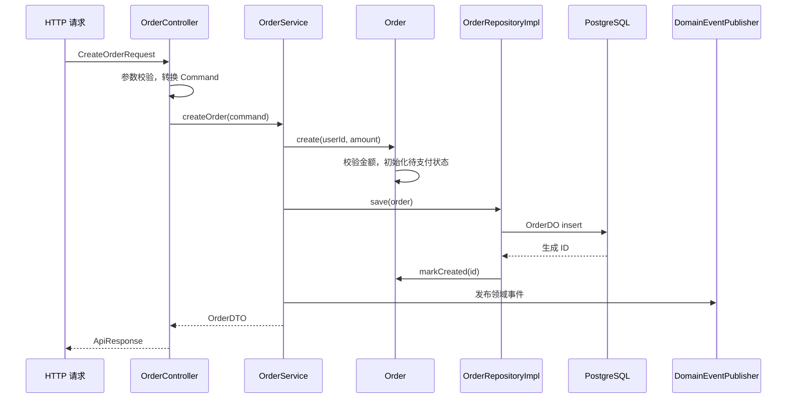

# 跟随示例理解 DDD 四层结构

user、order 是两个小业务示例：用户维护资料，订单维护金额和状态。它们用来展示从 HTTP 请求到聚合行为、数据库保存和 DTO 返回的完整流程。创建自己的项目时，参考[新项目起步指南](START_NEW_PROJECT.md)替换这些示例。

## 先运行并观察

按 [README](../README.md#运行示例)准备示例数据库、配置连接并启动应用。测试可独立运行：

```bash
./mvnw test
```

创建用户后创建订单，观察 Controller、应用服务、聚合与仓储各自负责的内容：

```bash
curl -X POST http://localhost:8080/api/users \
  -H 'Content-Type: application/json' \
  -d '{"name":"alice","email":"alice@example.com","wechat":"alice_wx"}'

curl -X POST http://localhost:8080/api/orders/create \
  -H 'Content-Type: application/json' \
  -d '{"userId":1,"totalAmount":99.99}'

curl 'http://localhost:8080/api/orders/page?page=1&size=10&sort=createdAt,desc'
```

创建订单时，将 userId 换成用户创建响应返回的 ID。

## 创建订单的调用链



### 接口层：把协议转换为命令

`CreateOrderRequest` 使用 Jakarta Validation 检查用户 ID 和金额。`OrderController` 将请求转换为 `CreateOrderCommand` 并调用应用服务；不负责生成 SQL，也不直接修改订单状态。

同一用例将来需要通过消息或命令行调用时，可以增加协议适配器，复用应用服务。

### 应用层：编排用例与事务

`OrderService.createOrder` 在 `orderTransactionManager` 管理的本地事务中创建聚合、保存并发布领域事件。输出使用 `OrderDTO`，调用方不接触数据库 DO。

支付用例遵循同样流程：读取订单、调用 `pay()`、保存结果、发布事件、清理相关缓存。状态转换规则写在聚合中。

### 领域层：表达业务规则

`Order.create` 要求用户 ID 为正数、金额为正数并精确到分。新订单处于 `PENDING` 状态。

| 行为 | 允许的起始状态 | 结果状态 |
|---|---|---|
| `pay()` | PENDING | PAID |
| `cancel()` | PENDING | CANCELLED |
| `complete()` | PAID | COMPLETED |

`Order` 不暴露状态 setter，也不依赖 Spring、Mapper、Redis 或 RocketMQ。仓储接口 `OrderRepository` 和领域事件发布接口描述所需能力，由基础设施提供实现。

用户示例展示跨聚合规则：`User.register` 和 `changeEmail` 通过 `UserUniquenessChecker` 检查名称或邮箱。数据库唯一约束处理并发请求中的唯一性竞争。

### 基础设施层：持久化和协议适配

`OrderRepositoryImpl` 把 `Order` 转换为 `OrderDO`，通过 `OrderMybatisPlusMapper` 读写数据库。DO 上包含表名、主键、版本等注解，Converter 显式映射所有字段。

插入后的主键同步回聚合，并补登创建事件。更新时，MyBatis-Plus 根据版本生成乐观锁条件；过期对象不能覆盖其他请求刚完成的状态变更。事务管理器与 Mapper 会话工厂使用同一个 DataSource。

## 列表、分页和跨上下文查询

接口层的 `PageableConverter` 把 Web 分页参数转换为领域 `PageRequest`。仓储使用 MyBatis-Plus 的 `Page` 执行 SQL，然后转换为领域 `PageResult`；上层不依赖 MyBatis-Plus 类型。

排序字段经过白名单转换，默认按创建时间倒序，并以 ID 确定同值记录的顺序。更多实现细节见[仓储指南](REPOSITORY_IMPLEMENTATION_GUIDE.md)。

订单列表只保存用户标识。`OrderService` 通过 `UserInfoQueryClient` 一次批量查询用户简介；基础设施适配器通过用户 Mapper 的 Lambda 查询只读取 ID、名称和手机号。这个接口将订单用例所需的信息与用户仓储的完整操作能力分开。

## 缓存、事件和任务入口

| 能力 | 应用或领域接口 | 基础设施实现 |
|---|---|---|
| 缓存 | `CacheService` | `SimpleCacheService` |
| 领域事件发布 | `DomainEventPublisher` | 订单事件 Producer 与消息转换器 |
| 邮件 | `EmailSender` | `EmailService` |
| 用户简介 | `UserInfoQueryClient` | `UserInfoQueryClientImpl` |

缓存键和 TTL 在 `CachePolicy` 定义。订单超时任务通过领域仓储查询待支付订单，再调用邮件端口发送通知。

这些示例帮助理解端口与实现的关系。实际业务需要可靠消息、跨库写入、去重通知等行为时，应根据需求设计相应机制。

## 开始自己的第一条用例

选择一个明确的业务行为，先实现聚合规则，再定义仓储接口、DO/Mapper、应用命令和服务，最后连接请求与响应。同步设计字段和约束，使内存状态与实际存储一致。

保留一份简单的测试起点：对关键业务规则做隔离验证，对 Mapper 绑定与数据库行为做必要集成验证。工程中的测试说明见[测试使用文档](API_TEST_CASES.md)，完整裁剪步骤见[新项目起步指南](START_NEW_PROJECT.md)。
